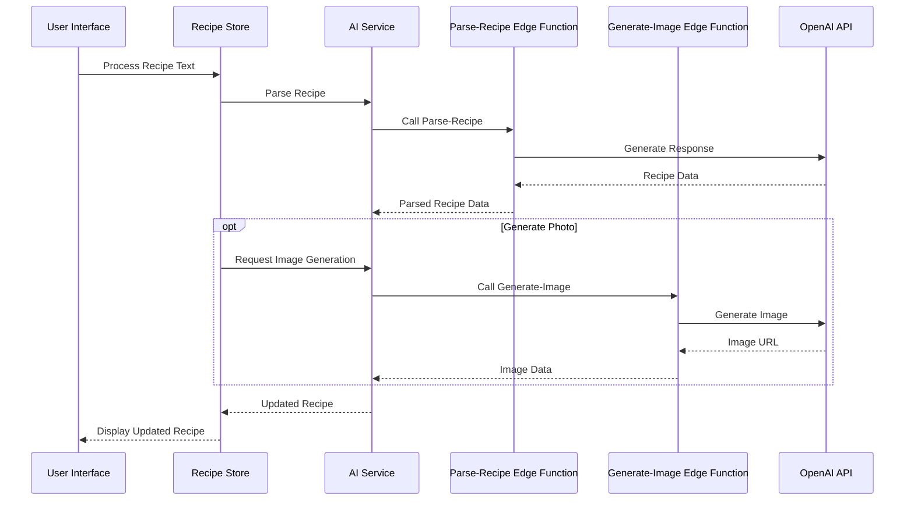
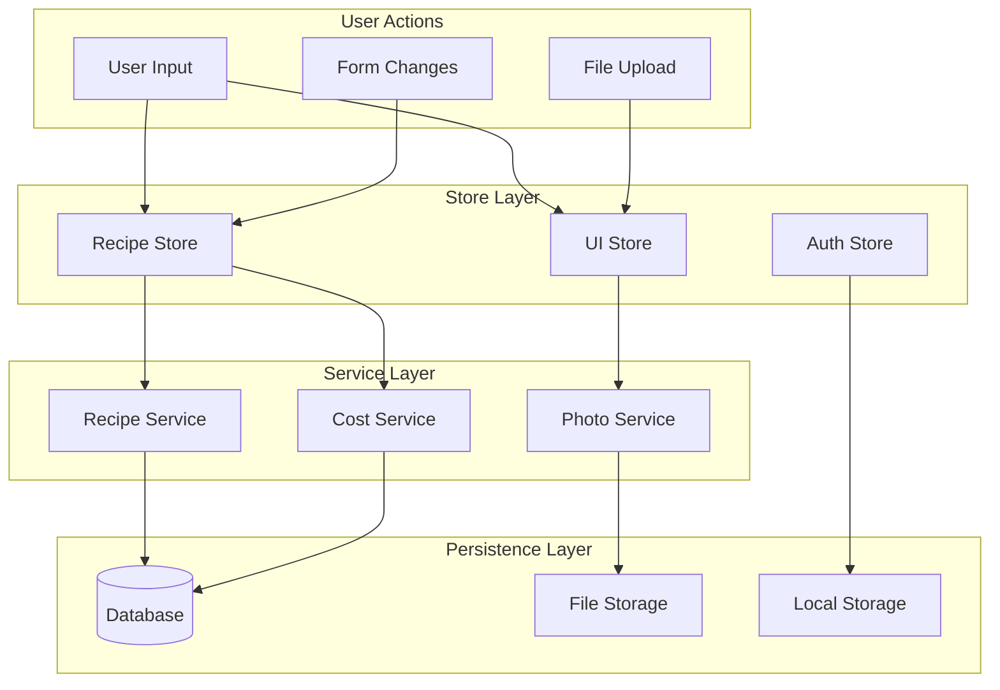
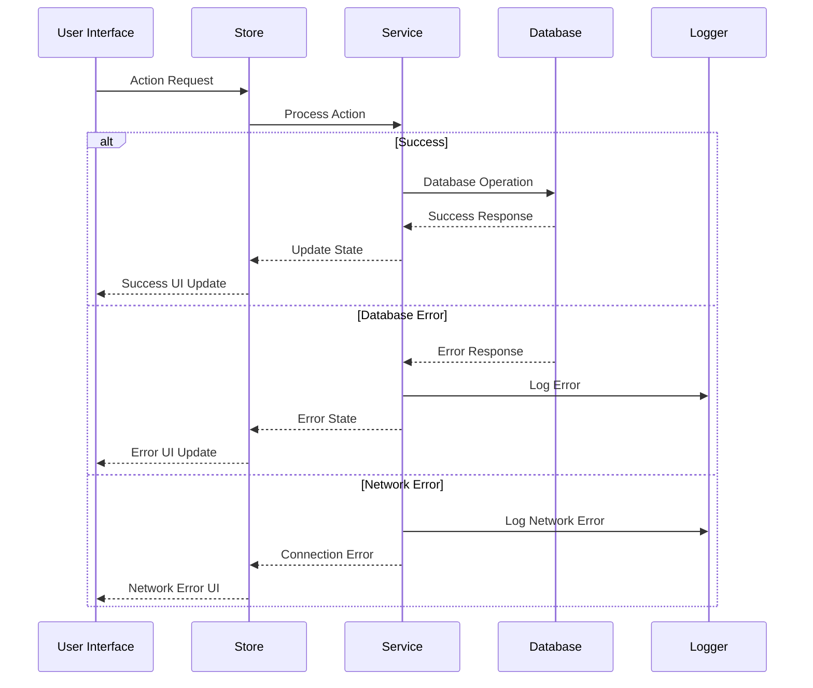
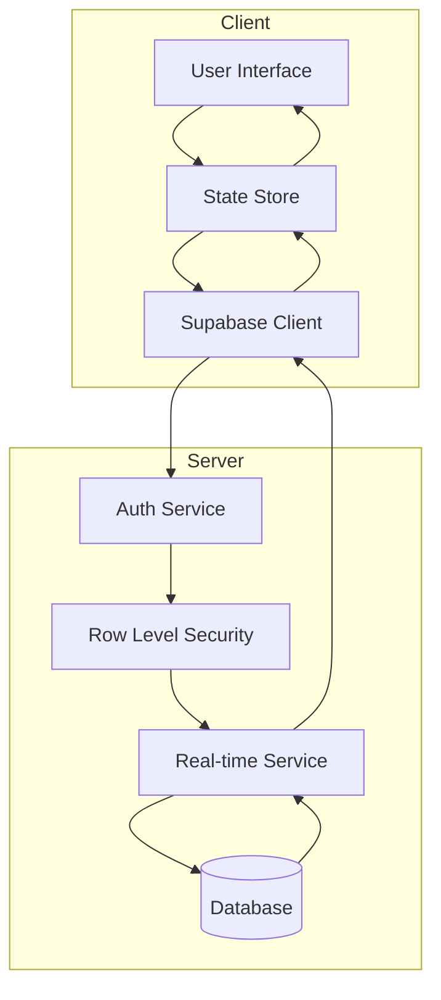
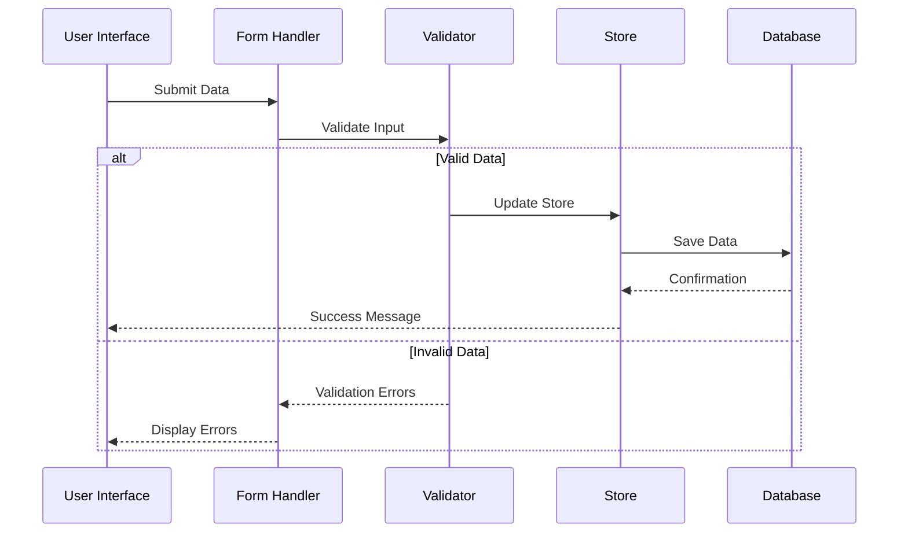
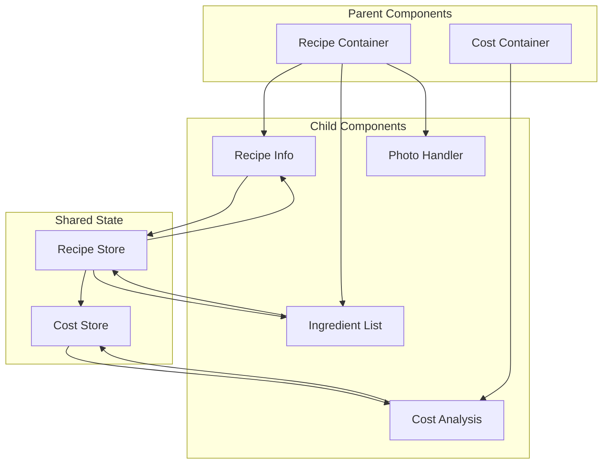

# Technical Implementation Documentation

[Previous content remains unchanged up to Data Flow Architecture section...]

## Data Flow Architecture

[Previous diagrams remain unchanged...]

### AI Integration Flow


```

### State Management Flow


### Error Handling Flow


### Real-time Updates Flow


### Data Validation Flow


### Component Communication Flow


[Previous content remains unchanged...]